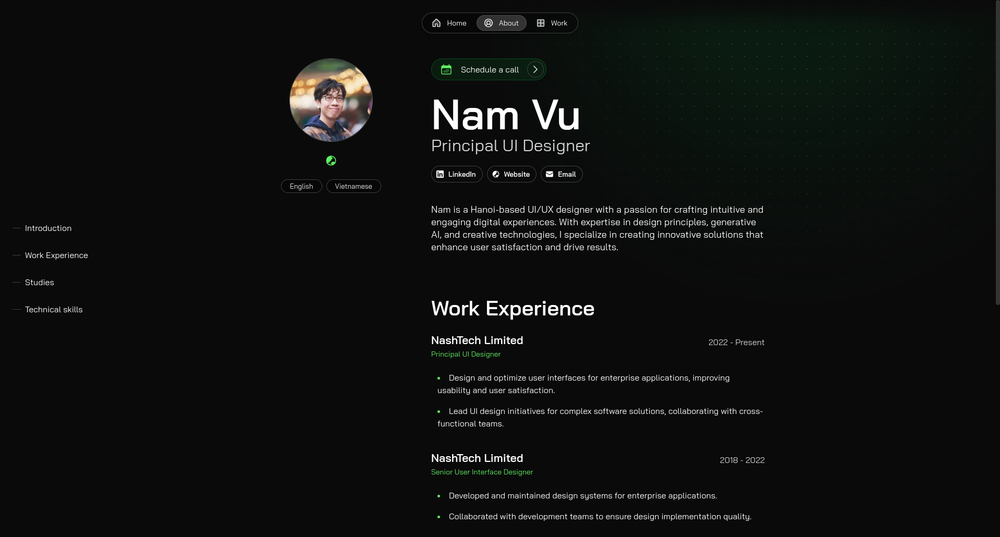

# **Build your portfolio with Once UI's Magic Portfolio**

View the [demo here](https://cv2.namvu.net).




# **Getting started**

Magic Portfolio was built with [Once UI](https://once-ui.com) for [Next.js](https://nextjs.org). It requires Node.js v18.17+.

**1. Clone the repository**
```
git clone https://github.com/once-ui-system/magic-portfolio.git
```

**2. Install dependencies**
```
npm install
```

**3. Run dev server**
```
npm run dev
```

**4. Edit config**
```
src/app/resources/config
```

**5. Edit content**
```
src/app/resources/content (or content-i18n for localization)
```

**6. Create blog posts / projects**
```
Add a new .mdx file to src/app/[locale]/blog/posts or src/app/[locale]/work/projects
```

# **Features**

## **Once UI**
- All tokens, components & features of [Once UI](https://once-ui.com)

## **SEO**
- Automatic open-graph and X image generation with next/og
- Automatic schema and metadata generation based on the content file

## **Design**
- Responsive layout optimized for all screen sizes
- Timeless design without heavy animations and motion
- Endless customization options through [data attributes](https://once-ui.com/docs/theming)

## **Content**
- Render sections conditionally based on the content file
- Enable or disable pages for blog, work, gallery and about / CV
- Generate and display social links automatically
- Set up password protection for URLs

## **Localization (NEW)**
- Magic Portfolio now supports localization with the next-intl library
- See more info in resources/config.js

# **Authors**

Connect with us on Threads or LinkedIn.

Lorant Toth: [Threads](https://www.threads.net/@lorant.one), [LinkedIn](https://www.linkedin.com/in/tothlorant/)  
Zsofia Komaromi: [Threads](https://www.threads.net/@zsofia_kom), [LinkedIn](https://www.linkedin.com/in/zsofiakomaromi/)

Localization added by [François Hernandez](https://github.com/francoishernandez)

# **Get involved**

- Join the [Design Engineers Club on Discord](https://discord.com/invite/5EyAQ4eNdS) and share your portfolio with us!
- Report a [bug](https://github.com/once-ui-system/magic-portfolio/issues/new?labels=bug&template=bug_report.md).

# **License**

Distributed under the CC BY-NC 4.0 License.
- Commercial usage is not allowed.
- Attribution is required.

See `LICENSE.txt` for more information.

# **Deploy with Docker**

There are two ways to deploy Magic Portfolio using Docker:

## **Using Docker Compose (Recommended)**

1. Create a docker-compose.yml file:
```yaml
services:
  web:
    image: ghcr.io/vnt87/namvucv:latest
    ports:
      - "6969:3000"
    environment:
      - NODE_ENV=production
      - NEXT_TELEMETRY_DISABLED=1
    restart: unless-stopped
```

2. Run with Docker Compose:
```bash
docker compose up -d
```

The application will be available at `http://localhost:6969`

## **Using Docker CLI**

Run directly using Docker CLI:
```bash
docker run -d -p 6969:3000 \
  -e NODE_ENV=production \
  -e NEXT_TELEMETRY_DISABLED=1 \
  ghcr.io/vnt87/namvucv:latest
```

The application will be available at `http://localhost:6969`
